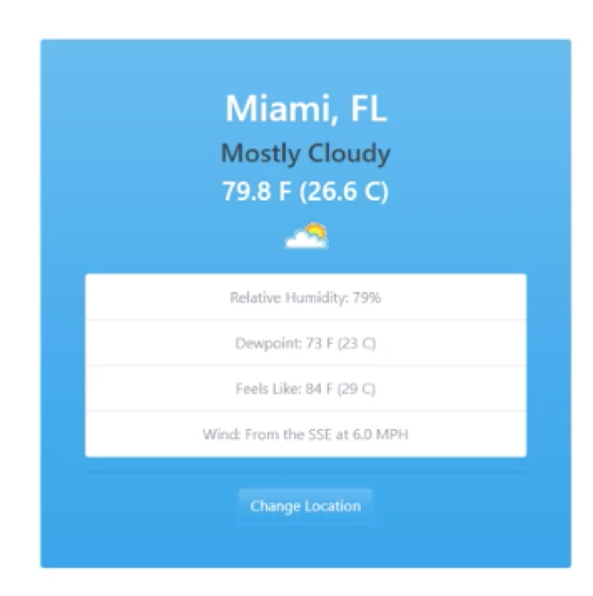
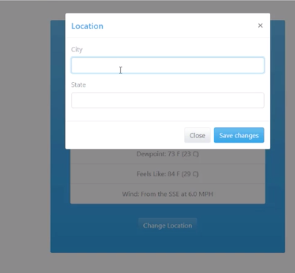

# Weather API page

A page using a weather API in order to show weather for selected city and state. 

It has a change location possibility and the changed city and state persists to local storage.

Bootstrap with a theme from bootswatch has been used for styling.
[bootswatch](https://bootswatch.com)

## Screenshots

## Author
* Albert Stjärne (https://github.com/AlbertStjarne)